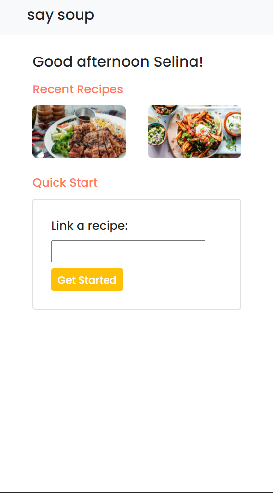

# Say Soup

Say Soup is an interactive voice app cooking assistant that makes it easy to connect with and cook with others. The user can launch the app and submit a link to an online recipe. The app then processes the recipe and determines what all the steps and ingredients are so that it can begin communicating through a voice assistant. The voice app portion was created with [Voiceflow](https://www.voiceflow.com/). 

## Available Scripts
To run on your the app from the root repository, run 
#### `npm run dev`

Currently developed to be viewed best on a mobile-sized screen. 

